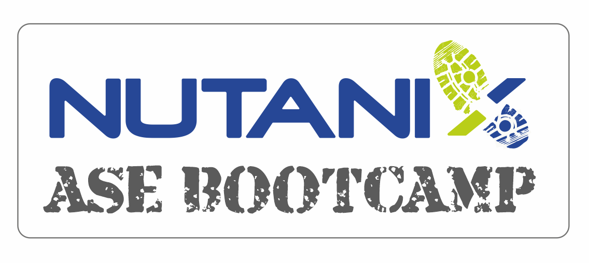

.. title:: Associate SE Programme

.. toctree::
  :maxdepth: 2
  :caption: Week 1
  :name: _week_1
  :hidden:

  /week1/week1content

.. toctree::
  :maxdepth: 2
  :caption: Week 2
  :name: _week_2
  :hidden:

  /week2/week2content

.. toctree::
  :maxdepth: 2
  :caption: Week 3
  :name: _week_3
  :hidden:

  /week3/week3content

.. toctree::
  :maxdepth: 2
  :caption: Week 4
  :name: _week_4
  :hidden:

  /week4/week4content

.. toctree::
  :maxdepth: 2
  :caption: Week 5
  :name: _week_5
  :hidden:

  /week5/week5content

.. toctree::
  :maxdepth: 2
  :caption: Week 6
  :name: _week_6
  :hidden:

  /week6/week6content

.. toctree::
  :maxdepth: 2
  :caption: Week 7
  :name: _week_7
  :hidden:

  /week7/week7content

----

**Associate SE Training Framework**

Use this framework for the enablement of the Associate SEs. The core topics will need to fit around the day-to-day requirements of the SE Manager, time for the ASEs to become acclimatised, online learning, exams as well as New Hire Training being factored into the timetable.
