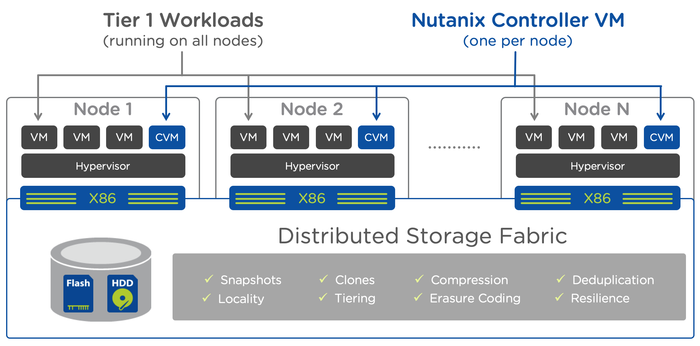
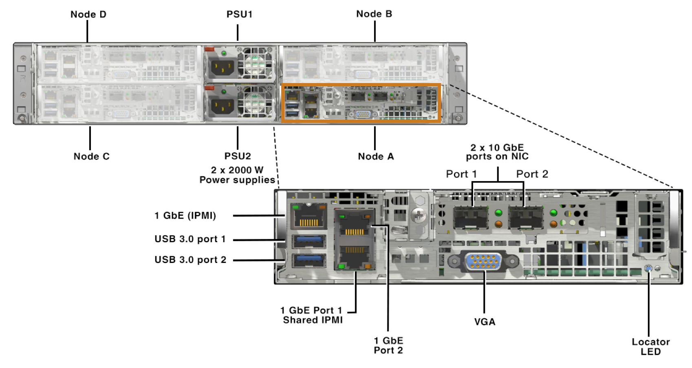

Sales & Core AHV
================

Command of the Message & MEDDPICC
+++++++++++++++++++++++++++++++++
.. sidebar:: Expected duration

    0.5 day for the session

.. note:: **Objective:** Provide background to the sales process account teams follow

C.O.T.M.
--------
Explain : How we use the process to qualify, verify and prove we understand the needs of the customer

Content : Delivered using prepared slides

MEDDPICC
--------
Explain : Why this is necessary during to the sales cycle and how this demonstrates we genuinely own the opportunity

Content : Delivered using prepared slides

----

Yahoo vs Google
+++++++++++++++
.. sidebar:: Expected duration

    0.25 day for the session

.. note:: **Objective:** Present the story of Google identifying the need to change

NCSR Level 2
++++++++++++
.. sidebar:: Expected duration

    0.75 day for the session

.. note:: **Objective:** Deliver Nutanix Certified Sales Representative Level 2 curriculum, leading to exam

----

Core AHV
++++++++
.. sidebar:: Expected duration

    1 day for the session

.. note:: **Objective:** Deliver a Nutanix style '101 Bootcamp'

Cluster & Node architecture
---------------------------
Explain : Nutanix basics 101

Content : Slide deck and whiteboard

*Objective: prepare audience to be able to draw up our architecture*

I/O CDP
-------
*Objective: explain why the architecture delivers high performance I/O and its failsafe data protection*

-  Reads and writes in an RF2 example

-  OpLog
   -  Quantity of SSDs used by the OpLog

   -  Software RAID 1

   -  < 16kb & > 64kb write pathing

-  Guarantee of how a write operation is committed correctly and a read request is 100% true of its original. Expand on this further to drive pre-fail notification and subsequent offline-ing of a disk

-  North/South & East/West data locality of virtual machine *hot* data (explain that no other HCI vendor functions in this manner)

Data locality
-------------
*Objective: re-iterate the North/South & East/West CDP and where it isn’t a good fit*

-  Use the example of a VM migration where the data is local, VM moves and where data now resides in relation to its original

-  When data locality doesn’t work well (de-dupe, ABS and storage only nodes)

Replication Factors (RF2 & RF3)
-------------------------------
*Objective: understand how to identify when to use 2 or 3*

-  Describe the minimum requirements for RF2 & RF3 and in which scenarios would each apply?

-  What is the ‘maximum cluster size’ for RF2 before tipping into RF3? (provoke a discussion as no actual number exists)

-  RF3 can suffer up to 25% performance degradation versus RF2 due to its additional write and metadata updates

Storage Pools and Containers
----------------------------
*Objective: describe the methods used by the hypervisors and that minimal is the utopia*

-  Which hypervisors use what protocols

-  What is the ‘perfect’ amount of Containers in a single Nutanix Cluster?

-  Store templates and VMs on the same container

Compression / Deduplication / Erasure Coding (EC-X)
---------------------------------------------------
*Objective: explain the different disk optimisation techniques and their relevance*

-  Compression

   -  Inline and post process

   -  LZ4 inline

   -  LZ4HC 3 days after

   -  Do not use for encrypted data

-  Deduplication

   -  Block size is 16KB

-  Erasure Coding

   -  What it is and it's purpose?

   -  8k & 4k granularity for EC-X

-  When to use the methods above in different environments
-  Don't forget to mention the dynamic behaviours and how no other HCI vendors compare to us

Data Protection
---------------
*Objective: describe the differences of each, functionality gained and lost with each hypervisor and why snapshots are not backups*

-  Our snapshot process

-  Asynchronous, Synchronous and Metro Availability

   -  Why Synchronous replication is not Metro

-  The differences in functionality of these features for each hypervisor

-  NearSync and its pre-requisites

   -  7% SSD overhead

   -  A minimum of 1.2TB SSDs

   -  40TB maximum node size

-  CloudConnect

Networking
----------
*Objective: describe the physical (and logical) network elements for Nutanix including the terminology used*

-  Physical ports on a node

   -  IPMI and failover IPMI

   -  LAN ports

-  CVM NIC layout

-  ‘Storage traffic’ separation

-  Access and Trunk ports

-  LACP

-  Hypervisor and CVM ‘same subnet’ requirement

-  Support ‘supported’ NIC speeds and refer to the Networking Best Practice Guide (BP2050)

Mixing and matching of nodes
----------------------------
*Objective: describe the flexibility and ‘configure to order’ approach with the caveats of mixing*

-  Considerations

   -  Unable to mix hardware vendors in the same cluster

   -  Multiple clusters each using different hardware vendors is permitted

   -  Mixed cluster with storage heavy nodes, the impact of imbalance

   -  Part population of drives

   -  SSD imbalance across nodes and the potential impact to Curator

   -  Different CPUs in the same Nutanix Cluster from AOS, hypervisor and workload perspective

   -  Mixed node configurations in the same block is not permitted, it's not a technical reason

Expansion and Reduction
-----------------------
*Objective: describe the flexibility of cluster explanation and node eviction*

-  Flexible

   -  Add any node of the same hardware vendor

   -  Remove a node from a cluster for re-purposing

      -  Reclaim licenses

      -  Duration of node eviction

Failure scenarios
-----------------
*Objective: preparing for customer failure questions during demos and workshops*

-  Node failure

-  CVM failure

   -  …and rolling upgrade

-  Disk failure

-  SSD failure (disks 1&2)

   -  On a single SSD node

      -  Node no longer accessible

   -  One a dual SSD node

      -  CVM reboots node to check metadata

-  NTP failure

   -  Cluster won’t start

   -  Protection domain snapshots fail

Shadow Clones
-------------
*Objective: describe why it exists and also that it’s not just for VDI*

-  Why have it?

-  What hypervisors are supported?

-  What triggers the feature on non-AHV clusters? (The three CVM trigger)

-  Functionality difference between ESXi / Hyper-V and AHV (Copy of write, no waiting for three CVM trigger)

Data-at-rest-Encryption
-----------------------
*Objective: awareness to position the software and hardware options and pre-requisites*

-  The software and hardware options

-  Differences in functionality between hypervisors

-  KMS options, third party and Nutanix native

Prism / Prism Central
---------------------
*Objective: overview the Element and Central differences, the fully distributed architecture(s) and resilience*

-  Prism Element navigation and demonstrate how to deliver a ‘10-15 minute first meeting demo’

-  Prism Central and Prism Pro features

-  Prism Central Scale-Out
