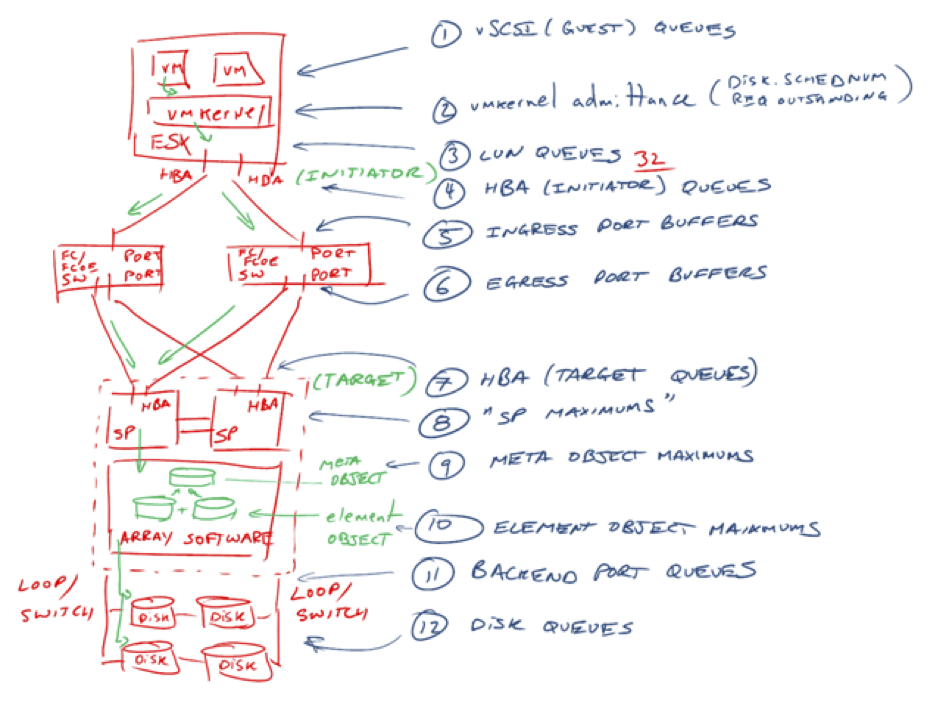

Whiteboard
==========

Whiteboard our proposition
++++++++++++++++++++++++++
.. sidebar:: Expected duration

    1 day for the session

.. note:: **Objective:** Demonstrate how to whiteboard a 'traditional' server/storage stack to Nutanix, demo Prism and follow selected hands on labs

Whiteboard flow
---------------
Explain : Draw up the common 3-tier stack, example below, highlight the pain points of configuration then transition to Nutanix

Content : whiteboard interactive

----

Prism demo
++++++++++
.. sidebar:: Expected duration

    0.25 day for the session

.. note:: **Objective:** Learn how to demonstrate Prism

Navigate
--------
Explain : Overview Prism. Follow Hardware > Storage > Virtual Machines > Analysis

Content : laptop interactive, movie of a |DEMO|

..   |DEMO| raw:: html

  <a href="https://drive.google.com/open?id=1jzMmHYpXHbysS_4-LoTMr_rjrtRAXzm-" target="_blank">demo</a>

Hands on Labs
+++++++++++++
.. sidebar:: Expected duration

    0.75 day for the session

.. note:: **Objective:** Select no more than 2 labs from the GTS materials

The Global Tech Summit bootcamps:

https://bootcamps.nutanix.handsonworkshops.com/workshops/c7322d40-4973-4ea2-8517-8658664d8fee/view/
